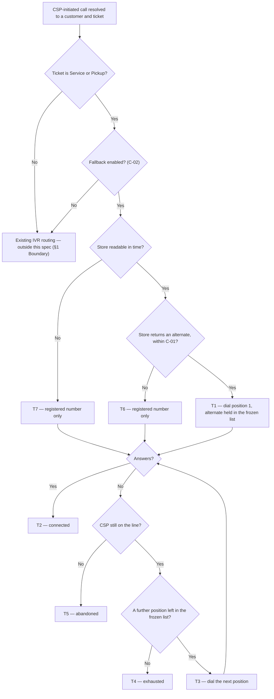

# IVR Alternate Number Routing — reaching the customer on a second number

| | | | |
|---|---|---|---|
| **Owner** — Ashish Raj (PM) | **Reviewer** — Rahul (Eng Lead) | **Status** — Signed off | **Sign-off** — Signed off · 5 Aug 2026 |
| **Version** — v2.4 · 5 Aug 2026 | | | |

---

## 1. Objective & Definition of Success

**Objective.** A CSP who calls a customer about their restore or pickup ticket reaches that customer — if the registered number does not answer, the call moves on by itself to the alternate number held for that customer, and the customer's chances of being reached increase.

**Boundary.** This spec governs **CSP-initiated** IVR calls on **Service (restore) and Pickup** tickets, at every CSP where IVR 2.0 is live. It governs one thing: **which numbers the IVR dials, and in what order, once a call has been resolved to a customer.**

- **Holding the numbers is not this spec's.** The alternate number store, how a number gets into it, and the portal that manages it are specified and deployed elsewhere — the Customer Alternate Number Store PRD. This spec **reads** that store and never writes to it (R4, AC-REG-5).
- **The list is built when the call is placed, never earlier.** What the store held when the ticket was created is irrelevant; what it holds at the moment of the call is what gets dialled. This holds for every call on the same active ticket, so a number added between two calls is used on the second (R6, AC-DIAL-5, AC-DIAL-6).
- **Whether a number is fit to dial is the store's judgement.** This spec dials what the store returns for a customer. It applies no age test, no validity test and no ordering of its own beyond putting the registered number first (R1, AC-REG-6).
- **Install tickets are out of scope.** Install is the source of this spec's benchmark, not a family it applies to (AC-REG-2).
- **Customer-initiated calls** are the escalation-chain PRD's, not this one's (AC-REG-1).
- **The registered number** is never changed, replaced or reordered. It is always dialled first (G2).
- **How the IVR decides whom to dial is IVR 2.0's, unchanged.** This spec is an increment on top of it. IVR 2.0 resolves a call to a customer and ticket in **three** ways (§8), and this spec begins only once one of them has done so, enriching only what it produced (R5, AC-RES-4):
  1. the caller enters a PIN;
  2. the call comes from the app, which carries its own cached mapping;
  3. the call comes from the caller's dialer with no PIN, and the caller has exactly one active ticket, so the ticket is unambiguous.
  Caller identification, PIN handling, what happens when a dialer caller has more than one active ticket, and dead-end handling all remain IVR 2.0's (AC-RES-4).
- **Ring durations** are Exotel applet configuration, not parameters of this spec (see Overrides). "Does not answer" is defined in §8.
- **What the CSP is told** — nothing about which number answered, or that an alternate exists (AC-REG-3).

### Guardrails

| ID | Guardrail | One line | Anchors |
|---|---|---|---|
| G1 | **Invisible fallback** | The call moves to the next number on its own; the CSP never presses a key, hears an announcement, or has the call dropped and re-established. | R1 · AC-GRD-1 · MQ-2 |
| G2 | **The registered number is always first** | Every run starts at the customer's registered number, so an alternate never displaces it. | R2 · AC-GRD-2 · MQ-7 |
| G3 | **Only this customer's numbers** | A run only ever dials numbers the store holds against the customer who owns the ticket — never another customer's, never the CSP's own. | R4 · AC-GRD-3 · MQ-6 |
| G4 | **The same list however resolved** | The dial list is the same whichever of IVR 2.0's three resolution paths named the customer. | R5 · AC-GRD-4 · MQ-10 |

### Success metrics

Ticket-level connect rate is defined in §8. A ticket where the CSP disconnected before any number answered **counts as not connected** (T5, MQ-5). Both figures are CSP-initiated, Phase-1 cohort, 2 Jul – 3 Aug 2026.

| ID | Metric | Baseline | Target | Source |
|---|---|---|---|---|
| M1 | Ticket-level connect rate — **Service** (restore) | 66.7% | 75.8% | MQ-1 |
| M2 | Ticket-level connect rate — **Pickup** | 50.7% | 75.8% | MQ-1 |

**Where 75.8% comes from.** It is what **install** tickets achieved on CSP-initiated calls in the window above, before this spec shipped — the closest thing to a ceiling this direction is known to reach. Install is **not in scope**; it is the reference point only, and the figure is frozen at its pre-launch value so it cannot drift. It is also direction-matched on purpose: install's all-directions figure (79.6%) mixes in customer-initiated calls, and its customer-initiated figure (69.0%) belongs to the escalation-chain PRD, so neither can be used here.

**How far these can move depends on how many customers hold an alternate number.** A ticket whose customer holds none gets exactly one dial, as it does now (T6), so the fallback can only act on the covered share of the base. MQ-8 reports that share, which is what explains a connect rate that does or does not move.

**Reaching a different person is not the same as reaching the customer.** An alternate number is answered by whoever holds that handset, and this spec cannot prove it was the customer. MQ-2 and MQ-9 record which position answered on every call, so a rate that rises while the registered number answers less often is visible rather than hidden.

**Invariant:** G2 — runs where the registered number was not dialled first = 0, zero tolerance. Monitored via MQ-7.

**Invariant:** G3 — numbers dialled that the store does not hold against the ticket's customer = 0, zero tolerance. Monitored via MQ-6.

---

## 2. User Stories & Rules

| ID | Story | MUST | MUST NOT |
|---|---|---|---|
| R1 | As a CSP trying to reach a customer about their job, I want the call to try their other number by itself, not fail on the first ring-out. | **(a)** Move to the next number in the dial list by itself when the current one does not answer (§8). **(b)** Bridge the call to the first number that answers. | **(a)** Ask the CSP to press a key, hold, redial or dial another number. **(b)** Play the CSP any announcement about the fallback. **(c)** Disconnect and re-establish the call in order to advance. |
| R2 | As a customer, I want my main number tried first — it is the one I gave you. | Dial the registered number as position 1 of every run (G2). | Skip, reorder or replace the registered number, ever. |
| R3 | As a CSP, I want a bounded number of attempts, not an open-ended sequence. | Dial at most C-01 numbers in one run, the registered number included, taking the alternates in the order the store returned them. | Dial beyond C-01, or place two dials of one run at the same time. |
| R4 | As a customer, I want only my own numbers dialled about my job, and I do not want a call changing my records. | **(a)** Restrict every dial to numbers the store holds against the customer who owns the ticket (G3). **(b)** Read the store only. | **(a)** Dial another customer's number, the CSP's own number, or any number the store does not hold for this customer. **(b)** Add, change or remove anything in the store as a result of placing a call. **(c)** Judge a number the store returned as unfit to dial — age, validity and ordering are the store's. |
| R5 | As a CSP, I want the same fallback whether I called from the app, dialled back and entered a PIN, or dialled back with a single ticket open and entered nothing. | Build the same dial list whichever of the three resolution paths (§8) named the customer and ticket (G4). | **(a)** Apply the fallback on some resolution paths and not others. **(b)** Change how any of the three paths resolves a call — the app cache, PIN handling, or single-active-ticket matching — or what a PIN means. |
| R6 | As a customer who gave my other number after raising the ticket, I want it used on the next call about it rather than ignored for arriving late. | Ask the store for the customer's numbers **at the moment each call is placed**, and dial what it returns then — on every call for the same active ticket, however many there are. | **(a)** Resolve, cache or carry a dial list from ticket creation, or from any time before the call. **(b)** Leave out an alternate because it was added after the ticket was created, or because an earlier call for the same active ticket did not have it. |

---

## 3. System Behaviour

### 3a. System flow chart

**Precedence — the CSP hanging up beats advancing.** If the CSP disconnects while a number is ringing and before the next dial has been placed, the run ends and no further number is dialled (T5, AC-RACE-1).

**Precedence — one bridged leg only.** If a ringing number answers while the run is advancing past it, the call bridges to exactly one number (T2, AC-RACE-2).

**Precedence — the list is frozen when the run begins.** A list resolved at the start of a run is used to the end of that run; a change in the store mid-run does not alter it, and applies from the next run (AC-RACE-3).

### 3b. State transition table — canon

Lifecycle of a **fallback run**, created when a CSP-initiated call resolves to a customer holding a Service or Pickup ticket. Each outbound call creates its own run; no state carries between runs. The alternate number's own lifecycle belongs to the Customer Alternate Number Store PRD.

| ID | From | Action / Trigger | Rule / Check | To | Side-effects |
|---|---|---|---|---|---|
| T1 | — | CSP-initiated call resolved to a customer and an in-scope ticket | Fallback enabled (C-02); the store returns at least one alternate for that customer | Ringing position 1 | Registered number dialled first (R2, G2). The dial list is resolved and frozen **at this moment — when this call is placed, not when the ticket was created and not when an earlier call on the same active ticket was placed** (R6): registered number, then the alternates the store returned now, in its order, capped at C-01 (R3). List length recorded (MQ-4). |
| T2 | Ringing position N | The ringing number answers | — | Connected | Call bridged (R1b). Which position answered, and whether it was the registered number or the alternate, recorded (MQ-2, MQ-9). Terminal. |
| T3 | Ringing position N | The ringing number does not answer (§8) | A further position remains in the frozen list | Ringing position N+1 | Next number dialled (R3), and not before the current dial has finished. No CSP action, no announcement, no reconnection (R1, G1). |
| T4 | Ringing position N | The ringing number does not answer (§8) | No further position remains | Exhausted | Existing unconnected-call handling applies. Ticket counted as not connected (M1, M2, MQ-5). Terminal. |
| T5 | Ringing position N | The CSP disconnects | — | Abandoned | Run ends; no further number is dialled. Ticket counted as not connected (M1, M2, MQ-5). Terminal. |
| T6 | — | CSP-initiated call resolved to a customer and an in-scope ticket | The store returns no alternate for that customer | Ringing position 1 | One dial only, to the registered number. No answer routes to T4, not T3. **The common case wherever coverage is low** (MQ-8). |
| T7 | — | CSP-initiated call resolved to a customer and an in-scope ticket | The store cannot be read in time to be used | Ringing position 1 | **Failure envelope:** a call is never failed for want of a list — it degrades to the registered number alone. No answer routes to T4. No alternate is guessed, or reused from an earlier run. |

---

## 4. Screen Requirements

**Not applicable — this feature has no screen.** The fallback happens entirely on the phone network, and G1 requires it be invisible: the CSP is never shown or told anything about it.

The one screen that touches alternate numbers is the internal portal that manages them, and that belongs to the Customer Alternate Number Store PRD along with the rest of the store (§1 Boundary).

---

## 5. Configurability

| ID | Parameter | Default | Range | Who changes it |
|---|---|---|---|---|
| C-01 | Maximum numbers dialled in one run, registered number included (T1, R3) | 2 | Raise when a customer may hold more than one alternate number | Product |
| C-02 | Fallback enabled — kill switch (T1) | On, wherever IVR 2.0 is live | On / Off | Product + Eng |

**Two parameters only, on purpose.** How long each number rings is Exotel applet configuration (see Overrides). Whether a number is old enough to stop dialling, or valid at all, is the store's judgement and not a parameter here (R4 must-not(c)). Which CSPs are covered follows the IVR service's own rollout.

---

## 6. Measurement

| ID | The system must be able to answer… | Feeds |
|---|---|---|
| MQ-1 | Of in-scope tickets with at least one CSP-initiated call, what share had at least one call where a person answered — split by ticket family. Abandoned runs count as not connected. | M1 · M2 |
| MQ-2 | For each run, which position answered — registered, alternate, or none. | G1 · M1 · M2 |
| MQ-3 | For each position, the share of dials to that position that were answered. | G2 · how much of any gain came from the alternate |
| MQ-4 | How long each frozen dial list was, and how many numbers the store returned that C-01 excluded. | R3 · C-01 |
| MQ-5 | How many runs ended Connected, Exhausted or Abandoned. | M1, M2 definition · T4 · T5 |
| MQ-6 | Whether any number dialled in a run was not held by the store against that ticket's customer. | G3 invariant (R4) |
| MQ-7 | Whether any run dialled something other than the registered number first. | G2 invariant (R2) |
| MQ-8 | How many customers in the in-scope base hold an alternate number, and how that is moving. | M1 · M2 — the covered share is what explains a rate that does or does not move |
| MQ-9 | For one call, the outcome of **every** number dialled — one row each: which number, at which position, whether it was the registered number or the alternate, and whether it answered, did not answer, was busy or could not be reached. Every row tied to that call by a single identifier, and to the ticket and customer. A number never reached because the run ended first has no row. | G2 · G3 · underpins MQ-2 · MQ-3 · MQ-4 |
| MQ-10 | For each call, which of the three resolution paths named the customer — entered PIN, app cache, or dialer with a single active ticket. | G4 · R5 |

---

## 7. Acceptance Criteria

**Example data** — customer Meena, registered number 09811100022, with the store holding one alternate for her, 09811100044. CSP `CSP-4412`, technician Ravi, Service ticket `TKT-88231`. Calls on 12 Aug 2026, with C-01 = 2.

**"Does not answer"** throughout means the outcome defined in §8 — Exotel reporting the dialled number as unanswered, busy or unreachable. The ring duration that produces it is Exotel applet configuration, not set by this spec.

### DIAL — Building the dial list (T1, T6, T7)

| AC | Given / When / Then | Verifies | Status |
|---|---|---|---|
| AC-DIAL-1 | **Given** the store returns 09811100044 for Meena, **When** Ravi calls her on `TKT-88231` at 15:20, **Then** the frozen dial list is exactly 09811100022 at position 1 and 09811100044 at position 2. | R2 · R3 · T1 · G2 | Settled |
| AC-DIAL-2 | **Given** the store returns no alternate for Meena, **When** Ravi calls her, **Then** the frozen dial list is exactly 09811100022 at position 1, and no position 2 exists. | T6 · G2 | Settled |
| AC-DIAL-3 | **Given** the store returns an error, or does not answer in time to be used, when asked for Meena's numbers, **When** Ravi's call is bridged, **Then** the frozen dial list is exactly 09811100022, and the call is bridged rather than failed. | T7 | Settled |
| AC-DIAL-4 | **Given** a Pickup ticket for Meena and 09811100044 returned for her, **When** a CSP calls her on that ticket, **Then** a two-position dial list is built — Pickup is in scope. | T1 · M2 · §1 Boundary | Settled |
| AC-DIAL-5 | **Given** `TKT-88231` was created on 10 Aug 2026 when the store held no alternate for Meena, 09811100044 was added on 11 Aug, and the ticket is still active, **When** Ravi calls her on 12 Aug, **Then** the frozen dial list is 09811100022 at position 1 and 09811100044 at position 2 — the number is used even though it arrived after the ticket. | R6 · T1 | Settled |
| AC-DIAL-6 | **Given** Ravi called Meena on 12 Aug about `TKT-88231` when the store held 09811100044, **When** the stored alternate is changed to 09811100066 and Ravi calls again on 13 Aug about the same still-active ticket, **Then** the second run's position 2 is 09811100066 and 09811100044 is not dialled — every call on an active ticket takes the latest stored number. | R6 · R6 must-not(b) · T1 | Settled |

### FB — Falling back and connecting (T2, T3)

| AC | Given / When / Then | Verifies | Status |
|---|---|---|---|
| AC-FB-1 | **Given** the two-position list from AC-DIAL-1, **When** 09811100022 answers, **Then** Ravi is bridged to 09811100022. | R1b · T2 | Settled |
| AC-FB-2 | **Given** the same list, **When** 09811100022 answers, **Then** no dial is placed to 09811100044. | R1b · T2 | Settled |
| AC-FB-3 | **Given** the same list, **When** 09811100022 does not answer, **Then** 09811100044 is dialled. | R1a · T3 | Settled |
| AC-FB-4 | **Given** the same list, **When** the run advances from position 1 to position 2, **Then** no announcement was played to Ravi and no keypress was requested of him. | R1 must-not(a) · R1 must-not(b) · G1 | Settled |
| AC-FB-5 | **Given** the same list, **When** the run advances from position 1 to position 2, **Then** Ravi's call was never disconnected and re-established — one continuous leg from bridge to end. | R1 must-not(c) · G1 | Settled |
| AC-FB-6 | **Given** the same list, **When** 09811100022 returns busy, **Then** 09811100044 is dialled — busy is treated as not answering. | T3 · §8 | Settled |
| AC-FB-7 | **Given** the same list, **When** 09811100022 is ringing, **Then** no dial to 09811100044 has yet been placed. | R3 must-not · T3 | Settled |

### END — Run endings (T4, T5)

| AC | Given / When / Then | Verifies | Status |
|---|---|---|---|
| AC-END-1 | **Given** the two-position list with 09811100044 ringing at position 2, **When** it does not answer, **Then** the run's end state is Exhausted. | T4 | Settled |
| AC-END-2 | **Given** the run in AC-END-1, **When** the ticket is counted for MQ-1, **Then** `TKT-88231` counts as not connected. | T4 · M1 · MQ-5 | Settled |
| AC-END-3 | **Given** 09811100022 is ringing at position 1, **When** Ravi disconnects before any dial to position 2 is placed, **Then** the run's end state is Abandoned and no dial was placed to 09811100044. | T5 | Settled |
| AC-END-4 | **Given** the run in AC-END-3, **When** the ticket is counted for MQ-1, **Then** `TKT-88231` counts as not connected. | T5 · M1 · MQ-5 | Settled |

### RES — All three resolution paths (R5)

| AC | Given / When / Then | Verifies | Status |
|---|---|---|---|
| AC-RES-1 | **Given** the store returns 09811100044 for Meena, **When** Ravi dials the masked number and enters the PIN for `TKT-88231`, **Then** the frozen dial list is 09811100022 at position 1 and 09811100044 at position 2 — the same list as AC-DIAL-1, where he called from the app. | R5 · G4 · T1 | Settled |
| AC-RES-2 | **Given** the store returns 09811100044 for Meena and `TKT-88231` is Ravi's only active ticket, **When** he dials the masked number from his phone's dialer and enters no PIN, **Then** the frozen dial list is 09811100022 at position 1 and 09811100044 at position 2 — the same list again. | R5 · G4 · T1 | Settled |
| AC-RES-3 | **Given** Ravi's no-PIN dialer call from AC-RES-2, **When** 09811100022 does not answer, **Then** 09811100044 is dialled — the fallback is not limited to app-originated or PIN-entered calls. | R5 must-not(a) · T3 · G4 | Settled |
| AC-RES-4 | **Given** a call resolved by any of the three paths, **When** the IVR names the customer and ticket, **Then** the customer whose numbers are dialled is the customer on that ticket, and nothing about how the path reached that answer differs from IVR 2.0 today. | R5 must-not(b) · §1 Boundary | Settled |

### WF — Workflows and per-dial tracking (MQ-9)

| AC | Given / When / Then | Verifies | Status |
|---|---|---|---|
| AC-WF-1 | **Given** the two-position list from AC-DIAL-1, **When** 09811100022 does not answer and 09811100044 answers, **Then** Ravi is bridged to 09811100044 on the same inbound call, and `TKT-88231` counts as connected. | R1 · T1 · T3 · T2 | Settled |
| AC-WF-2 | **Given** the same list, **When** neither number answers, **Then** exactly two dials were placed, 09811100022 before 09811100044, and the run's end state is Exhausted. | T1 · T3 · T4 | Settled |
| AC-WF-3 | **Given** the run in AC-WF-1, **When** its record is examined, **Then** it holds exactly two rows — 09811100022 at position 1, not answered; 09811100044 at position 2, answered — both under one call identifier and tied to Meena and `TKT-88231`. | MQ-9 | Settled |
| AC-WF-4 | **Given** each row of the run in AC-WF-1, **When** it is read, **Then** it states whether that number was Meena's registered number or her alternate. | MQ-9 · MQ-2 · MQ-3 | Settled |
| AC-WF-5 | **Given** Ravi called Meena at 15:20 and again at 15:45, **When** both runs are examined, **Then** each has its own call identifier and every row belongs to exactly one of them. | MQ-9 · T1 | Settled |
| AC-WF-6 | **Given** the single-position run in AC-DIAL-2, **When** its record is examined, **Then** it holds exactly one row — a run with no fallback is recorded the same way as one with it. | MQ-9 · T6 | Settled |

### FAIL — When the store cannot be read (T7)

| AC | Given / When / Then | Verifies | Status |
|---|---|---|---|
| AC-FAIL-1 | **Given** the store is unreachable, **When** Ravi calls Meena, **Then** a dial is placed to 09811100022 — a call is never failed because the store could not be read. | T7 | Settled |
| AC-FAIL-2 | **Given** the store is unreachable and 09811100022 does not answer, **When** the dial completes, **Then** the run's end state is Exhausted and exactly one dial was placed — no alternate is guessed, or reused from an earlier run. | T7 · T4 | Settled |

### REG — Regression and boundary (§1)

| AC | Given / When / Then | Verifies | Status |
|---|---|---|---|
| AC-REG-1 | **Given** `TKT-88231`, **When** Meena calls Ravi rather than Ravi calling her, **Then** no dial list is built by this spec and routing follows the escalation-chain PRD. | §1 Boundary | Settled |
| AC-REG-2 | **Given** an **install** ticket for Meena and 09811100044 returned for her, **When** a CSP calls her on that ticket, **Then** exactly one dial is placed, to 09811100022, and 09811100044 is not dialled — install is out of scope. | §1 Boundary | Settled |
| AC-REG-3 | **Given** Ravi is bridged to 09811100044, **When** the call connects, **Then** Ravi is given no indication of which number answered and no indication that an alternate exists. | §1 Boundary · G1 | Settled |
| AC-REG-4 | **Given** the run in AC-WF-1, **When** the call statuses Exotel returned are examined, **Then** each of the two dials has its own status record, and MQ-9's per-run record exists in addition to them. | MQ-9 · §1 Boundary | Settled |
| AC-REG-5 | **Given** the store holds 09811100044 for Meena, **When** any run for Meena completes in any end state, **Then** the store still holds 09811100044 unchanged — placing a call writes nothing to the store. | R4b · §1 Boundary | Settled |
| AC-REG-6 | **Given** the store returns an alternate for Meena that was last used two years ago, **When** Ravi calls her, **Then** it is dialled at position 2 — this spec applies no age test of its own, because fitness to dial is the store's judgement. | R4 must-not(c) · §1 Boundary | Settled |

### RACE — Simultaneity (§3a precedence rules)

| AC | Given / When / Then | Verifies | Status |
|---|---|---|---|
| AC-RACE-1 | **Given** 09811100022 is ringing at position 1 and the run has determined that position 2 exists, **When** Ravi disconnects before the dial to position 2 is placed, **Then** no dial is placed to 09811100044 and the run's end state is Abandoned. | T5 · precedence 1 | Settled |
| AC-RACE-2 | **Given** the run is advancing from position 1 to position 2, **When** 09811100022 answers after the advance has begun but before the dial to position 2 has connected, **Then** exactly one bridged leg exists for the call. | T2 · precedence 2 | Settled |
| AC-RACE-3 | **Given** a run is in flight with 09811100044 in its frozen list, **When** that number is removed from the store before the run reaches position 2, **Then** the run still dials 09811100044, and the next run for Meena does not. | precedence 3 · T1 | Settled |

### DUP — Duplicate triggers

| AC | Given / When / Then | Verifies | Status |
|---|---|---|---|
| AC-DUP-1 | **Given** Ravi's call at 15:20 ended Exhausted, **When** he calls Meena again at 15:45, **Then** the new run's position 1 is 09811100022. | R2 · T1 · G2 | Settled |
| AC-DUP-2 | **Given** two CSPs call Meena on two different tickets while neither run has ended, **When** both runs proceed, **Then** each dials its own frozen list, and neither run's outcome changes the other's list or end state. | T1 | Settled |

### BV — Boundary values (C-01)

| AC | Given / When / Then | Verifies | Status |
|---|---|---|---|
| AC-BV-1 | **Given** C-01 is 1, **When** a CSP calls a customer for whom the store returns an alternate, **Then** exactly one dial is placed, to the registered number. | C-01 · R3 · G2 | Settled |
| AC-BV-2 | **Given** C-01 is 2 and the store returns one alternate, **When** a CSP calls and the registered number does not answer, **Then** exactly two dials are placed. | C-01 · R3 | Settled |

### CFG — Configurability

| AC | Given / When / Then | Verifies | Status |
|---|---|---|---|
| AC-CFG-1 | **Given** the fallback is switched off (C-02), **When** Ravi calls Meena for whom the store returns an alternate, **Then** exactly one dial is placed, to 09811100022. | C-02 | Settled |

### GRD — Guardrails

| AC | Given / When / Then | Verifies | Status |
|---|---|---|---|
| AC-GRD-1 | **Given** every run in a week that reached position 2, **When** each call's record is examined, **Then** none played an announcement to the CSP, none requested a keypress, and none shows the call disconnected and re-established. | G1 · R1 | Settled |
| AC-GRD-2 | **Given** every run in a week, **When** the first dial of each is checked, **Then** every one was placed to that customer's registered number. | G2 · R2 · MQ-7 | Settled |
| AC-GRD-3 | **Given** every run in a week, **When** every number dialled is checked against what the store holds for that run's customer, **Then** all of them are held for that customer, and none is another customer's or the CSP's own. | G3 · R4a · MQ-6 | Settled |
| AC-GRD-4 | **Given** the same customer and their single active ticket, **When** three calls are placed — one from the app, one by dialling back and entering the PIN, and one from the dialer with no PIN — **Then** all three frozen dial lists hold the same numbers in the same positions. | G4 · R5 · MQ-10 | Settled |

---

## 8. Glossary

| Term | Meaning | Owner (domain) |
|---|---|---|
| Alternate number | An additional phone number the store holds against a customer, existing so a call can be connected to them when their registered number does not answer. Defined in full — including how it gets there, who may change it, and whether it is still fit to use — by the **Customer Alternate Number Store PRD**. This spec only reads it, and dials what it returns. | Customer |
| Registered number | The customer's primary number on their Wiom account. Always position 1, never reordered or replaced by this spec (G2, R2). | Customer |
| Fallback run | **Canonical definition:** the ordered list of numbers dialled for one outbound CSP call, and the act of moving down it when a number does not answer. Created per call, with its list resolved from the store at the moment that call is placed and frozen for the rest of that run (R6). An active ticket may have many runs over its life, and each resolves its own list afresh. Carries: its own identifier, the ticket and customer, the frozen list, the position that answered if any, and the end state. | — |
| Does not answer | **Canonical definition:** the outcome for one dial when Exotel reports the number as unanswered, busy, or unreachable. The ring duration that produces it is Exotel applet configuration (see Overrides), not set by this spec. Every rule and acceptance criterion that turns on a number "not answering" means exactly this. | Telephony |
| Resolution path | **Canonical definition:** how IVR 2.0 works out which customer and ticket a call is about, before this spec does anything. There are exactly three: **(1)** the caller enters a PIN; **(2)** the call comes from the app, which carries its own cached mapping; **(3)** the call comes from the caller's dialer with no PIN, and the caller has exactly one active ticket. All three are IVR 2.0's and unchanged by this spec, which only enriches the destination each produces (R5, G4). | Telephony |
| Position | A number's place in a frozen dial list. Position 1 is always the registered number; the alternate follows it. | — |
| Exhausted · Abandoned | A run's end state. **Exhausted**: every position was dialled and none answered. **Abandoned**: the CSP disconnected before any position answered. Both count as not connected. | — |
| Ticket-level connect rate | **Canonical definition:** of tickets that had at least one call in the chosen direction and window, the share where at least one of those calls was answered by a person. A ticket counts once however many calls it had. Any answered call counts, however short. Not to be confused with call-level connect rate, which is per call; comparisons must never mix the two grains. | — |
| Service · Pickup ticket | The two families in scope. **Service** is the restore family — a live customer whose connection needs restoring, called "Service" in the ops dashboard. **Pickup** is netbox recovery, collecting equipment from a customer. Install is out of scope. | — |

---

## 9. Notes for System Capabilities

Whether these are one system or several is the implementer's design.

| Capability | Needed by |
|---|---|
| Read a customer's alternate numbers from the store — and never write to it. | R4 · T1 · AC-REG-5 |
| Ask the store for a customer's numbers at the moment each call is placed — never earlier, and never from a list carried over from ticket creation or from an earlier call on the same active ticket. | R6 · T1 · AC-DIAL-5 · AC-DIAL-6 |
| Build a dial list from what the store returned: registered number first, then the alternates in the store's order, capped at C-01 — and freeze it for one run. | T1 · R2 · R3 · G2 |
| Dial an ordered list for one outbound call, advancing on no answer, busy or unreachable, without the CSP acting, without an announcement, and without dropping the call. | T1 · T3 · R1 · G1 |
| End a run the moment the CSP disconnects, dialling nothing further; bridge to exactly one number even when an answer and an advance coincide. | T5 · T2 · precedence 1 · precedence 2 |
| Fall back to the registered number alone when the store cannot be read in time, without failing the call and without reusing a list from an earlier run. | T7 |
| Build the same list whichever IVR entry path resolved the destination, and record which path it was. | R5 · G4 · MQ-10 |
| Give each run an identifier and record one row per number dialled — the number, its position, whether it was the registered number or the alternate, and its outcome — tied to the customer and ticket. | MQ-9 |
| Report connect rate by ticket family, per-position answer rates, run end states, and the covered share of the base. | MQ-1 · MQ-2 · MQ-3 · MQ-5 · MQ-8 |
| Turn the fallback off, and change C-01, without a release. | C-01 · C-02 |

---

## Overrides

| Rule | What was done instead | Rationale | Approved by |
|---|---|---|---|
| §5 — every number that could change gets a C-id | Per-number ring duration and the total ringing a CSP hears are not C-ids | Exotel App Bazaar applet configuration, not a parameter of this service. Consistent with the escalation-chain PRD and with dropping `ES_CSPIVR_CALL_BRIDGE_MAX_RING_SECONDS` in June 2026. "Does not answer" is defined in §8 so the acceptance criteria stay testable without it. | Ashish Raj (PM), 5 Aug 2026 |
| Header — name consulted parties by domain | No consulted parties named | Carried over from the sibling IVR PRDs at the PM's instruction. | Ashish Raj (PM), 5 Aug 2026 |
