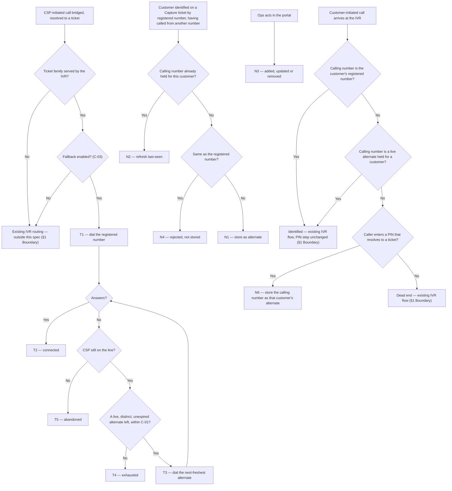

# IVR Alternate Number Routing — reaching the customer on a second number

| | | | |
|---|---|---|---|
| **Owner** — Ashish Raj (PM) | **Reviewer** — Rahul (Eng Lead) | **Status** — Draft | **Sign-off** — Pending |
| **Version** — v0.2 · 4 Aug 2026 | | | |

---

## 1. Objective & Definition of Success

**Objective.** A CSP who calls a customer about their installation, restore or pickup ticket reaches that customer — if the registered number does not answer, the call moves on by itself to another number the customer has told us they are reachable on, and the customer's chances of being reached increase.

**Boundary.** This spec governs a customer's alternate numbers wherever the IVR touches them, on Install, Service (restore) and Pickup tickets — every ticket family the IVR serves — at every CSP where IVR 2.0 is live. It covers three things: **holding** a customer's alternate numbers, **dialling** them when a CSP calls out, and **recognising** them when a customer calls in.

**Recognising them on the way in is not an extra.** IVR 2.0 identifies a caller by the number they call from, and a PIN then names the ticket. A customer calling from a second phone is a stranger to that first step, so today they reach a dead end however correct their PIN. Every alternate number this spec holds is therefore also a key that identifies its owner on an inbound call (R10, G6).

It leaves unchanged:

- **Customer-initiated escalation** — where a customer's call goes *after* it is identified, from the executor to the CSP's manager and owner, is a separate PRD (AC-REG-1).
- **The registered number itself** — this spec never changes, replaces or reorders a customer's registered number. That number is always dialled first (G2, AC-REG-2).
- **The PIN itself** — how PINs are issued, shown, entered, expired or matched to a ticket is governed by the existing IVR product spec. This spec changes only which calling numbers resolve to a customer, never what the PIN means or how it is checked (AC-REG-3).
- **What the CSP is told** — the CSP is not told which number answered, or that any alternate exists. Out of scope (AC-REG-4).
- **Call-status recording** — every call status Exotel returns is still recorded for each individual call, exactly as today. This spec adds to that record, it does not replace or reshape it (AC-REG-5).
- **Ring durations** — how long each number rings, and the total ringing a CSP hears, are Exotel applet configuration, not parameters of this spec (see Overrides).
- **Collecting alternate numbers anywhere but Capture** — the Customer App may offer a customer their own number list one day. Not in this version (AC-REG-6).

### Guardrails — promises that hold on every path

| ID | Guardrail | One line | Anchors |
|---|---|---|---|
| G1 | **Invisible fallback** | The call moves to the next number on its own; the CSP never presses a key, redials or is told what is happening. | R1 · AC-GRD-1 · MQ-2 |
| G2 | **The registered number is always first** | Every call starts at the customer's registered number, so an alternate never displaces it. | R2 · AC-GRD-2 · MQ-3 · MQ-7 |
| G3 | **One dial per number** | No number is dialled twice in one call, including an alternate that duplicates the registered number. | R3 · AC-GRD-3 · MQ-4 |
| G4 | **Only this customer's numbers** | The call only ever dials numbers held against the customer who owns the ticket — never another customer's, never the CSP's own. | R7 · AC-GRD-4 · MQ-6 |
| G5 | **Stale numbers are never dialled** | A number past its validity window (C-02) is never called, however few alternatives exist. | R6 · AC-GRD-5 · MQ-8 |
| G6 | **Known both ways** | A number good enough to dial is good enough to be recognised on the way in — the same list serves outbound and inbound. | R10 · AC-GRD-6 · MQ-12 |

### Success metrics

Ticket-level connect rate is defined in §8. A ticket where the CSP hung up before any number answered **counts as not connected** (T5, MQ-5). Connect-rate figures below are CSP-initiated, Phase-1 cohort, 2 Jul – 3 Aug 2026.

| ID | Metric | Baseline | Target | Source |
|---|---|---|---|---|
| M1 | **Alternate-number coverage** — share of active customers holding at least one live alternate number | 1.37% *(1,248 of 90,775 active customers, measured 3 Aug 2026)* | 25% within 6 months of launch ⚠️ *AI GENERATED — review* | MQ-9 |
| M2 | Ticket-level connect rate — **Service** (restore) | 66.7% | 75.8%, **conditional on M1** — see below | MQ-1 |
| M3 | Ticket-level connect rate — **Pickup** | 50.7% | 75.8%, **conditional on M1** — see below | MQ-1 |
| M4 | Share of connected tickets that connect on the **registered number** | ~100% *(today there is no second number to dial)* | No family falls below 90% ⚠️ *AI GENERATED — review* | MQ-3 |

**Coverage is the metric that matters first.** Only 1.37% of active customers hold a usable alternate number, and capture has produced **nine numbers in all of 2026, none since 1 April** — so the routing half of this spec has almost nothing to route to on the day it ships. Connect rate cannot move before coverage does. M2 and M3 are therefore stated as conditional: they become due once M1 reaches its target, and until then M1 is the metric this spec is judged on.

**Where 75.8% comes from.** It is what install tickets achieved on CSP-initiated calls in the window above — the closest thing to a ceiling this direction is known to reach. It is direction-matched on purpose: install's all-directions figure (79.6%) mixes in customer-initiated calls, and its customer-initiated figure (69.0%) belongs to the escalation-chain PRD, so neither can be used here. It is frozen as a pre-launch mark.

**M4 is the counter-metric.** If connect rate rises while M4 falls sharply, calls are being answered by whoever holds the alternate rather than by the customer. Reaching a different person is not the same as reaching the customer, and MQ-10 exists to tell the two apart.

**Invariant (not a metric):** G2 — calls where the registered number was not dialled first = 0, zero tolerance. Monitored via MQ-7, not trended.

**Invariant (not a metric):** G4 — numbers dialled that do not belong to the ticket's customer = 0, zero tolerance. Monitored via MQ-6, not trended.

**Invariant (not a metric):** G5 — dials placed to a number past its validity window = 0, zero tolerance. Monitored via MQ-8, not trended.

---

## 2. User Stories & Rules

| ID | Story | MUST | MUST NOT |
|---|---|---|---|
| R1 | As a CSP trying to reach a customer about their job, I want the call to try their other numbers by itself, not fail on the first ring-out. | **(a)** Move to the next number by itself when the current one does not answer. **(b)** Bridge the call to the first number that answers. | **(a)** Ask the CSP to press a key, hold, redial or dial another number. **(b)** Tell the CSP that a fallback happened or which number is ringing. |
| R2 | As a customer, I want my main number tried first — it is the one I gave you. | Dial the registered number first on every call (G2). | Skip, reorder or replace the registered number, ever. |
| R3 | As a customer who once called from my own main number, I do not want that number rung twice in one call. | Dial each distinct number once; where an alternate duplicates the registered number or another alternate, shorten the run (G3). | Dial the same number more than once in one call. |
| R4 | As a customer, I want my most recent number tried before my older ones — it is the one most likely to still be mine. | Order alternates by when each was last seen, newest first, and dial at most C-01 numbers in total. | Dial alternates in the order they were stored, at random, or beyond C-01. |
| R5 | As a customer who rings the call centre from a different phone, I want that number remembered so you can reach me on it. | **(a)** When a customer is identified on a Capture ticket by their registered number after calling from another number, store that calling number as an alternate against that customer, as structured data. **(b)** Where that number is already held, refresh how recently it was seen rather than storing it again. | Store a number as an alternate without knowing which customer it belongs to. |
| R6 | As a customer, I do not want a number I used once a year ago rung today — it may not be mine any more. | Treat an alternate as usable only within C-02 of when it was last seen, and never dial one outside that window (G5). | Dial an expired number, even when no other alternate exists. |
| R7 | As a customer, I want only my own numbers dialled about my job. | Restrict every dial to numbers held against the customer who owns the ticket (G4). | Dial another customer's number, the CSP's own number, or any number not held against this customer. |
| R8 | As an ops user, I need to add, correct or remove a customer's alternate number when I learn it is right or wrong. | **(a)** Let an authorised internal user add, update and remove a customer's alternate numbers. **(b)** Record who made each change and when. | Let a change be made without an identified user attached to it. |
| R9 | As the business, I need to know that a number we hold is our responsibility to get right. | Treat whoever entered a number — system or ops — as accountable for it being the right customer's number. | Assume a stored number is correct because it was dialled successfully before. |
| R10 | As a customer calling the IVR from my second phone, I want to be recognised and reach my ticket, not a dead end. | **(a)** Identify an inbound caller by any live alternate number held for them, exactly as by their registered number (G6). **(b)** Once identified, treat the call the same as one from the registered number — same PIN step, same routing, same ticket. | **(a)** Dead-end a caller whose number is held as a live alternate. **(b)** Treat a call from an alternate as lower-trust, or ask the caller anything extra because of it. |
| R11 | As a customer who called in from a new phone and proved who I am with my PIN, I want that number remembered. | Store the calling number as an alternate for the customer whose ticket the PIN resolved to, when that number is not already held (N6). | Store a calling number on the strength of an unverified or failed PIN attempt. |

---

## 3. System Behaviour

### 3a. System flow chart

**Precedence — CSP hangup beats fallback.** If the CSP disconnects while a number is ringing, the call ends there and no further number is dialled (T5, AC-RACE-1).

**Precedence — first answer wins.** If a number answers at the same instant the call moves on, the call bridges to the one that answered and the other dial is dropped; the CSP is never bridged to two people (T2, AC-RACE-2).

**Precedence — the number list is fixed at bridge time.** A list resolved when the call was bridged is used to the end of that call; an alternate added, removed or expiring mid-call does not change it (AC-RACE-3).

**Precedence — ops beats the system.** If ops removes a number at the same moment the system would store or refresh it, the removal stands and the number is not re-added by that same event (N3, AC-RACE-4).

### 3b. State transition table — canon

Two lifecycles, both canon (see Overrides).

#### 3b.1 — Lifecycle of a **fallback run** (created when a CSP-initiated call is bridged and resolves to an in-scope ticket)

Each outbound call creates its own run; no state carries between calls.

| ID | From | Action / Trigger | Rule / Check | To | Side-effects |
|---|---|---|---|---|---|
| T1 | — | CSP-initiated call bridged, resolved to an in-scope ticket | Fallback enabled (C-03) | Ringing the registered number | Registered number dialled first (R2, G2). The dial list is resolved and frozen now: registered number, then live unexpired alternates newest-first, deduplicated, capped at C-01 (R3, R4, R6). List length recorded (MQ-4). |
| T2 | Ringing a number | The ringing number answers | — | Connected | Call bridged (R1b). Which position answered is recorded (MQ-2, MQ-3, MQ-10). Terminal state. |
| T3 | Ringing a number | The ringing number does not answer, is busy, or the dial fails | A further number remains in the frozen list | Ringing the next number | Next-freshest alternate dialled (R4), and not before the current dial has finished unanswered. No CSP action and no announcement (R1a, R1 must-not(b), G1). |
| T4 | Ringing a number | The ringing number does not answer, is busy, or the dial fails | No further number remains | Exhausted | Existing unconnected-call handling applies, unchanged (§1 Boundary). Ticket counted as not connected (M2, M3, MQ-5). Terminal state. |
| T5 | Ringing a number | CSP disconnects | — | Abandoned | Run ends immediately; no further number is dialled. Ticket counted as not connected (M2, M3, MQ-5). Terminal state. |
| T6 | — | CSP-initiated call bridged, resolved to an in-scope ticket | The customer holds no live unexpired alternate | Ringing the registered number | One dial only — today's behaviour exactly (AC-REG-2). No answer routes to T4, not T3. **This is the common case at launch** (M1 baseline 1.37%). |
| T7 | — | CSP-initiated call bridged, resolved to an in-scope ticket | The customer's number list cannot be resolved | Ringing the registered number | **Failure envelope:** a call is never failed for want of a number list — it degrades to the registered number alone, which is today's behaviour. No answer routes to T4. How resolution is retried inside the call is the implementer's. |

#### 3b.2 — Lifecycle of an **alternate number** (a number, held against one customer, that the customer has indicated they are reachable on)

| ID | From | Action / Trigger | Rule / Check | To | Side-effects |
|---|---|---|---|---|---|
| N1 | — | A customer is identified on a Capture ticket by their registered number, having called from another number | The calling number differs from the customer's registered number and from every number already held for them | Live | Number stored against that customer as structured data, with when it was first and last seen (R5a). Becomes dialable immediately, ordered newest-first (R4). Source and the entering party recorded (R9, MQ-11). |
| N2 | Live or Expired | The same customer is identified again having called from a number already held for them | — | Live | Last-seen refreshed; the validity window (C-02) restarts from now (R5b). An expired number returns to Live. Its position in the freshness order rises. |
| N3 | Live or Expired | An authorised internal user adds, updates or removes the number in the ops portal | The user is identified | Live, or Removed | The change takes effect on the next call (R8a). The acting user and the time are recorded (R8b, MQ-11). A removed number is never dialled again unless re-added. |
| N4 | — | A calling number is offered for storage | It equals the customer's registered number, or is not a valid mobile number | Not stored | Rejected, so the registered number can never be dialled twice in one run (G3). The rejection is recorded so a broken capture path is visible (MQ-11). |
| N5 | Live | C-02 elapses since the number was last seen | — | Expired | Never dialled again (R6, G5) unless it returns via N2 or N3. It is retained, not deleted, so its history stays visible in the ops portal. |
| N6 | — | A customer calls the IVR from a number held for nobody, and enters a PIN that resolves to a ticket | The PIN resolved; the calling number differs from that customer's registered number and from every number already held for them | Live | Number stored against the ticket's customer, source recorded as PIN-verified (R11, MQ-11). **The strongest capture path in this spec** — the caller proved they hold the ticket, so no agent or ops step is needed. A failed or absent PIN stores nothing (R11 must-not). |

---

## 4. Screen Requirements

**Experience intent:** neither the customer nor the CSP notices anything. The one screen this spec adds is for internal staff, and its job is to make a customer's number list correct and accountable — every entry showing where it came from, who last touched it, and whether it is still usable.

**Master design file:** none yet — a named gap. The ops portal needs a design before build. ⚠️ *AI GENERATED — review*

### Customer number list — ops portal

Internal screen, for authorised call-centre and ops users only.

**States:** has numbers (one or more alternates held, live or expired) · empty (registered number only) · not found (no customer matches the search) · saving (a change submitted, not yet confirmed)
**Freshness:** on open, and after any change the user makes

| Element | Source / Routes to | Logic |
|---|---|---|
| Field — registered number | customer record | always shown, always first, never editable here (R2) |
| Field — alternate number | alternate number (§8) | shown in dial order, newest-seen first (R4); shown in full ⚠️ *AI GENERATED — review* |
| Field — last seen | alternate number · last-seen | drives the order and the expiry countdown (C-02) |
| Field — status | computed | Live, or Expired with the date it expired (N5); expired entries stay visible but are visibly not dialable (G5) |
| Field — will be dialled | computed | marks the numbers that would actually be used on the next call — the first C-01 live, distinct entries (R3, R4) |
| Field — source | alternate number · source | how it arrived: a customer call into Capture (N1), or an ops entry with the user's name (N3, R9) |
| Action — add number | N3 via §3a | for an authorised user only |
| Action — update number | N3 via §3a | for an authorised user only |
| Action — remove number | N3 via §3a | for an authorised user only; asks for confirmation, stating the number will no longer be called |
| Check — reject duplicate | — | refuses a number equal to the registered number or to one already held, and says which (N4, G3) |
| Check — reject invalid | — | refuses anything that is not a valid mobile number (N4) |
| Check — authorisation | — | an unauthorised user cannot see or change the list |

---

## 5. Configurability

| ID | Parameter | Default | Range | Who changes it |
|---|---|---|---|---|
| C-01 | Maximum numbers dialled in one fallback run, registered number included (T1, R4) | 3 | 1–5 | Product |
| C-02 | How long an alternate stays usable after it was last seen (N5, R6) | 6 months | 1–24 months | Product |
| C-03 | Fallback enabled — kill switch (T1) | On, wherever IVR 2.0 is live | On / Off | Product + Eng |

**Interaction note (C-01 × C-02).** The two interact on how many numbers a customer effectively has: C-02 decides which alternates are still live, and C-01 then caps how many of those get dialled. A customer with six live alternates and C-01 = 3 has only their two freshest ever tried; the rest are held, visible in the ops portal marked as not going to be dialled, and become reachable only if they are seen again and rise in the freshness order (N2). Numbers are never discarded to fit C-01.

**Where numbers are not parameters.** How long each number rings, and the total ringing a CSP hears, are Exotel applet configuration (see Overrides). Which CSPs and which ticket families are covered follow the IVR service's own rollout, as in the escalation-chain PRD.

---

## 6. Measurement

| ID | The system must be able to answer… | Feeds |
|---|---|---|
| MQ-1 | Of in-scope tickets with at least one CSP-initiated call, what share had at least one call where a person answered — split by ticket family. Abandoned runs count as not connected. | M2 · M3 |
| MQ-2 | For each call, which position in the dial list answered — registered, first alternate, second alternate, or none. | G1 · M4 |
| MQ-3 | For each position, the share of dials to that position that were answered. | M4 · G2 |
| MQ-4 | How long each frozen dial list was, and how many entries were dropped by dedupe or by the C-01 cap. | G3 · R3 · R4 · C-01 |
| MQ-5 | How many runs ended Connected, Exhausted or Abandoned. | M2, M3 definition · T4 · T5 |
| MQ-6 | Whether any number dialled in a run was not held against the ticket's customer. | G4 invariant (R7) |
| MQ-7 | Whether any run dialled something other than the registered number first. | G2 invariant (R2) |
| MQ-8 | Whether any dial was placed to a number outside its validity window (C-02). | G5 invariant (R6) |
| MQ-9 | How many active customers hold at least one live alternate number, and how that count is moving. | M1 — the gating metric |
| MQ-10 | For one call, the outcome of **every** number dialled, one row each — which number, at which position, and whether it answered, did not answer, was busy or could not be reached — with every row tied to that call by a single identifier, and to the ticket and customer. | M4 · G2 · G3 · G4 · G5 · underpins MQ-2 · MQ-3 · MQ-4 |
| MQ-11 | For each alternate number: where it came from — Capture, ops, or PIN-verified — who entered or last changed it, when it was first and last seen, and every rejection that stopped one being stored. | R5 · R8b · R9 · N4 · N6 · the health of the capture path |
| MQ-12 | Of inbound customer calls, how many were identified by a registered number, by an alternate number, and not at all — and of those not identified, how many went on to enter a valid PIN. | G6 · R10 · R11 · sizing what N6 will capture |

---

## 7. Acceptance Criteria

**Example data used throughout** ⚠️ *AI GENERATED — review* — customer Meena, registered number 09811100022. Alternates held against her: 09811100044 (last seen 20 Jul 2026) and 09811100055 (last seen 2 Feb 2026). CSP `CSP-4412`, technician Ravi, Service ticket `TKT-88231`. Calls on 12 Aug 2026, with C-01 = 3 and C-02 = 6 months.

### DIAL — Building and running the dial list (T1, T6, T7)

| AC | Given / When / Then | Verifies | Status |
|---|---|---|---|
| AC-DIAL-1 | **Given** Meena holds both alternates above, **When** Ravi calls her on `TKT-88231` at 15:20, **Then** the dial list is 09811100022, then 09811100044, then 09811100055 — registered first, alternates newest-seen first. | R2 · R4 · T1 · G2 | Settled |
| AC-DIAL-2 | **Given** Meena holds no alternate at all, **When** Ravi calls, **Then** 09811100022 alone is dialled and on no answer the call ends exactly as it does today. | T6 · AC-REG-2 | Settled |
| AC-DIAL-3 | **Given** Meena holds 09811100044 and also an alternate equal to 09811100022, **When** Ravi calls, **Then** 09811100022 is dialled once, and the list is 09811100022 then 09811100044 — two dials, not three. | R3 · T1 · G3 | Settled |
| AC-DIAL-4 | **Given** Meena holds four live alternates and C-01 is 3, **When** Ravi calls, **Then** exactly 3 numbers are dialled — the registered number and her two freshest alternates — and the other two are not called. | R4 · C-01 · T1 | Settled |
| AC-DIAL-5 | **Given** 09811100055 was last seen 2 Feb 2026, more than C-02 (6 months) before the call, **When** Ravi calls on 12 Aug 2026, **Then** it is not dialled, and the list is 09811100022 then 09811100044. | R6 · N5 · T1 · G5 | Settled |
| AC-DIAL-6 | **Given** the customer's number list cannot be resolved, **When** the call is bridged, **Then** 09811100022 alone is dialled — the call is bridged, never failed for want of a list. | T7 | Settled |

### FB — Falling back and connecting (T2, T3)

| AC | Given / When / Then | Verifies | Status |
|---|---|---|---|
| AC-FB-1 | **Given** the 3-number list from AC-DIAL-1, **When** 09811100022 answers, **Then** Ravi is bridged to it, no further number is dialled, and the answering position is recorded as the registered number. | R1b · T2 · MQ-2 | Settled |
| AC-FB-2 | **Given** the same list, **When** 09811100022 does not answer, **Then** 09811100044 is dialled next without Ravi pressing a key, hearing an announcement, or the call dropping. | R1a · T3 · G1 | Settled |
| AC-FB-3 | **Given** 09811100044 is then ringing, **When** it answers, **Then** Ravi is bridged to it, 09811100055 is never dialled, and the answering position is recorded as the first alternate. | R1b · T2 · T3 | Settled |
| AC-FB-4 | **Given** 09811100044 is ringing, **When** it is busy, **Then** the run advances — busy is treated the same as no answer. | T3 | Settled |
| AC-FB-5 | **Given** the 3-number list, **When** 09811100022 is ringing, **Then** neither alternate has rung — the numbers are dialled one after another, never together. | R2 · T3 · G2 | Settled |

### END — Run endings (T4, T5)

| AC | Given / When / Then | Verifies | Status |
|---|---|---|---|
| AC-END-1 | **Given** the 3-number list with the last alternate ringing, **When** it does not answer, **Then** the run ends Exhausted, existing unconnected-call handling runs unchanged, and `TKT-88231` counts as not connected. | T4 · M2 · MQ-5 | Settled |
| AC-END-2 | **Given** 09811100044 is ringing, **When** Ravi hangs up, **Then** the run ends Abandoned, 09811100055 is never dialled, and `TKT-88231` counts as not connected. | T5 · M2 · MQ-5 | Settled |

### CAP — Capturing a number (N1, N2, N4)

| AC | Given / When / Then | Verifies | Status |
|---|---|---|---|
| AC-CAP-1 | **Given** Meena calls the call centre from 09811100066, a number not held for her, **When** the agent identifies her by entering her registered number 09811100022 on the Capture ticket, **Then** 09811100066 is stored against Meena as a structured alternate, first-seen and last-seen 12 Aug 2026, and is dialable on her next call. | R5a · N1 | Settled |
| AC-CAP-2 | **Given** the same call but from 09811100044, which Meena already holds with last-seen 20 Jul 2026, **When** she is identified, **Then** no second entry is created; last-seen becomes 12 Aug 2026 and 09811100044 becomes her freshest alternate. | R5b · N2 | Settled |
| AC-CAP-3 | **Given** Meena calls from 09811100022, her own registered number, **When** she is identified, **Then** nothing is stored as an alternate, and the rejection is recorded. | N4 · G3 · MQ-11 | Settled |
| AC-CAP-4 | **Given** 09811100055 expired on 2 Aug 2026, **When** Meena calls from it on 12 Aug 2026 and is identified, **Then** it returns to Live with last-seen 12 Aug 2026 and is dialable again. | N2 · N5 | Settled |
| AC-CAP-5 | **Given** a call arrives from a number that cannot be tied to any customer, **When** the ticket is handled, **Then** nothing is stored — a number is never held without knowing whose it is. | R5 must-not · N1 | Settled |

### IN — Recognising a customer calling in (R10, N6)

| AC | Given / When / Then | Verifies | Status |
|---|---|---|---|
| AC-IN-1 | **Given** Meena holds 09811100044 as a live alternate, **When** she calls the IVR from it, **Then** she is identified as Meena and reaches the same PIN step and the same ticket she would have from 09811100022 — no dead end. | R10a · R10b · G6 | Settled |
| AC-IN-2 | **Given** the same call, **When** she enters her PIN, **Then** the PIN is checked exactly as it would be for a call from her registered number — no extra question, no additional check. | R10b · R10 must-not(b) · AC-REG-3 | Settled |
| AC-IN-3 | **Given** 09811100055 expired on 2 Aug 2026, **When** Meena calls from it on 12 Aug, **Then** it does not identify her — an expired number is not an identification key either. | R10a · N5 · G5 · G6 | Settled |
| AC-IN-4 | **Given** Meena calls from 09811100066, held for nobody, **When** she enters a PIN that resolves to `TKT-88231`, **Then** 09811100066 is stored as her alternate with source PIN-verified, and is dialable on her next call. | R11 · N6 | Settled |
| AC-IN-5 | **Given** a caller from 09811100066, **When** they enter a PIN that matches no ticket and the call dead-ends, **Then** nothing is stored — an unproven number never becomes an alternate. | R11 must-not · N6 | Settled |
| AC-IN-6 | **Given** a caller from 09811100066, **When** they hang up before entering any PIN, **Then** nothing is stored. | R11 must-not · N6 | Settled |
| AC-IN-7 | **Given** Meena calls from 09811100022, her registered number, **When** she enters a valid PIN, **Then** nothing is stored as an alternate — the registered number is not an alternate to itself. | N6 · N4 · G3 | Settled |

### OPS — The ops portal (N3)

| AC | Given / When / Then | Verifies | Status |
|---|---|---|---|
| AC-OPS-1 | **Given** an authorised ops user viewing Meena, **When** they add 09811100077, **Then** it is held against Meena as Live, marked as ops-entered with their name and the time, and is dialable on her next call. | R8a · R8b · N3 | Settled |
| AC-OPS-2 | **Given** the same user, **When** they remove 09811100044, **Then** it is not dialled on any later call, and who removed it and when remains visible. | R8a · R8b · N3 | Settled |
| AC-OPS-3 | **Given** the same user, **When** they try to add 09811100022, Meena's registered number, **Then** it is refused with the reason, and her list is unchanged. | N4 · G3 | Settled |
| AC-OPS-4 | **Given** an unauthorised internal user, **When** they open Meena's record, **Then** they can neither see nor change her number list. | R8a | Settled |
| AC-OPS-5 | **Given** Meena holds 09811100055, expired on 2 Aug 2026, **When** an ops user views her list, **Then** it is shown as Expired with that date and marked as not going to be dialled — visible, not hidden. | N5 · G5 | Settled |
| AC-OPS-6 | **Given** 09811100044 was answered on five separate calls, **When** an ops user views it, **Then** it still shows only its source and who entered it — no "verified" or "confirmed" standing has been earned by connecting, because answering proves someone picked up, not that the number is Meena's. | R9 · MQ-11 | Settled |

### WF — Workflows

| AC | Given / When / Then | Verifies | Status |
|---|---|---|---|
| AC-WF-1 | **Given** Meena holds both alternates, **When** Ravi calls at 15:20, the registered number does not answer and 09811100044 does, **Then** Ravi has spoken to Meena on one call, was never asked to redial, and `TKT-88231` counts as connected on the first alternate. | R1 · T1 · T3 · T2 · G1 | Settled |
| AC-WF-2 | **Given** the same setup, **When** none of the three answers, **Then** exactly three numbers were dialled in that order, the run ends Exhausted, and `TKT-88231` counts as not connected. | T1 · T3 · T4 · M2 | Settled |
| AC-WF-3 | **Given** Meena calls the call centre from 09811100066 on 12 Aug and is identified, **When** Ravi calls her on 13 Aug, **Then** 09811100066 is dialled as her freshest alternate, straight after the registered number — capture to use, end to end. | N1 · R4 · T1 | Settled |
| AC-WF-4 | **Given** the run in AC-WF-1, **When** its record is examined, **Then** it holds **two** rows — 09811100022 at position 1, not answered; 09811100044 at position 2, answered — both under one call identifier and tied to Meena and `TKT-88231`, and 09811100055 has no row. | MQ-10 · T3 · T2 | Settled |

### FAIL — Failure envelopes (T7)

| AC | Given / When / Then | Verifies | Status |
|---|---|---|---|
| AC-FAIL-1 | **Given** the number list cannot be resolved and the registered number does not answer, **When** the dial completes, **Then** the run ends Exhausted and existing unconnected-call handling runs — no alternate is guessed. | T7 · T4 | Settled |

### REG — Regression (§1 Boundary)

| AC | Given / When / Then | Verifies | Status |
|---|---|---|---|
| AC-REG-1 | **Given** `TKT-88231`, **When** Meena calls Ravi, **Then** the customer-initiated escalation chain runs as its own PRD defines and no alternate-number logic applies. | §1 Boundary | Settled |
| AC-REG-2 | **Given** a customer with no alternates — the common case at launch — **When** a CSP calls, **Then** behaviour is identical to before this spec: one dial to the registered number. | T6 · §1 Boundary | Settled |
| AC-REG-3 | **Given** any CSP-initiated call, **When** caller identification and PIN handling run, **Then** they are unchanged — this spec begins only once a call resolves to a ticket. | §1 Boundary | Settled |
| AC-REG-4 | **Given** Ravi is bridged to 09811100044, **When** the call connects, **Then** Ravi is told nothing about which number answered or that an alternate exists. | §1 Boundary · G1 | Settled |
| AC-REG-5 | **Given** the run in AC-WF-1, **When** the call statuses Exotel returned are examined, **Then** each dial has its own status record in the same shape and detail as before this spec — MQ-10's per-run record sits alongside it and replaces nothing. | MQ-10 · §1 Boundary | Settled |
| AC-REG-6 | **Given** the Customer App, **When** a customer opens it, **Then** it offers no way to see or manage their alternate numbers — not in this version. | §1 Boundary | Settled |

### RACE — Simultaneity (§3a precedence rules)

| AC | Given / When / Then | Verifies | Status |
|---|---|---|---|
| AC-RACE-1 | **Given** 09811100044 is ringing, **When** Ravi hangs up at the same instant the run would advance, **Then** 09811100055 is not dialled and the run ends Abandoned. | T5 · precedence 1 | Settled |
| AC-RACE-2 | **Given** the run is advancing from 09811100044 to 09811100055, **When** 09811100044 answers at that instant, **Then** Ravi is bridged to exactly one number. | T2 · precedence 2 | Settled |
| AC-RACE-3 | **Given** a run is in flight with its list frozen, **When** ops removes 09811100055 mid-call, **Then** that run still dials it as planned, and the removal applies from the next call. | precedence 3 · N3 | Settled |
| AC-RACE-4 | **Given** ops removes 09811100044 at the same moment Meena is identified calling from it, **When** both land together, **Then** the removal stands and the number is not re-added by that event. | precedence 4 · N2 · N3 | Settled |

### DUP — Duplicate triggers

| AC | Given / When / Then | Verifies | Status |
|---|---|---|---|
| AC-DUP-1 | **Given** Ravi's call at 15:20 ended Exhausted, **When** he calls again at 15:45, **Then** a fresh run starts at the registered number, not at an alternate. | R2 · T1 · G2 | Settled |
| AC-DUP-2 | **Given** Meena is identified twice in one day from 09811100066, **When** both are processed, **Then** she holds one entry for it, not two, with last-seen from the later call. | R5b · N2 | Settled |
| AC-DUP-3 | **Given** two CSPs call Meena at the same moment on two tickets, **When** both runs start, **Then** each dials its own frozen list independently. | T1 | Settled |

### BV — Boundary values (C-01, C-02)

| AC | Given / When / Then | Verifies | Status |
|---|---|---|---|
| AC-BV-1 | **Given** an alternate last seen exactly C-02 (6 months) before the call, to the day, **When** the list is built, **Then** it is still Live and is dialled — expiry bites after the window, not at it. | C-02 · N5 · R6 | Settled |
| AC-BV-2 | **Given** an alternate last seen one day past C-02, **When** the list is built, **Then** it is Expired and not dialled. | C-02 · N5 · G5 | Settled |
| AC-BV-3 | **Given** C-01 is 3 and Meena holds exactly two live alternates, **When** the list is built, **Then** all three numbers are dialled — at the cap, nothing is dropped. | C-01 · R4 | Settled |
| AC-BV-4 | **Given** C-01 is 1, **When** Ravi calls, **Then** only the registered number is dialled and no alternate is tried. | C-01 · G2 | Settled |

### CFG — Configurability

| AC | Given / When / Then | Verifies | Status |
|---|---|---|---|
| AC-CFG-1 | **Given** fallback is switched off (C-03), **When** Ravi calls a customer holding two live alternates, **Then** only the registered number is dialled and behaviour matches AC-REG-2 exactly. | C-03 | Settled |
| AC-CFG-2 | **Given** C-02 is changed from 6 months to 3, **When** the list is next built, **Then** an alternate last seen 4 months ago is Expired and not dialled, without anyone editing that customer's record. | C-02 · N5 | Settled |
| AC-CFG-3 | **Given** C-01 is raised from 3 to 4, **When** a customer with three live alternates is called, **Then** four numbers are dialled. | C-01 · R4 | Settled |

### GRD — Guardrails

| AC | Given / When / Then | Verifies | Status |
|---|---|---|---|
| AC-GRD-1 | **Given** any run reaching a second or third number, **When** the call is reviewed end to end, **Then** the CSP heard no announcement, pressed no key, and the call was never disconnected and re-established. | G1 · R1 | Settled |
| AC-GRD-2 | **Given** 1,000 runs across the cohort, **When** the first dial of each is checked, **Then** every one dialled the customer's registered number. | G2 · R2 · MQ-7 | Settled |
| AC-GRD-3 | **Given** any run for a customer whose alternates include a duplicate, **When** the dial list is checked, **Then** no number appears twice. | G3 · R3 · MQ-4 | Settled |
| AC-GRD-4 | **Given** any run on `TKT-88231`, **When** every number dialled is checked, **Then** all belong to Meena — none is another customer's, and none is the CSP's own. | G4 · R7 · MQ-6 | Settled |
| AC-GRD-5 | **Given** a customer whose only alternate expired yesterday, **When** a CSP calls, **Then** the expired number is not dialled even though it would have been the only fallback available. | G5 · R6 · MQ-8 | Settled |
| AC-GRD-6 | **Given** any number held live for a customer, **When** it is used both ways, **Then** the same number that a CSP call would dial also identifies that customer when they call in — one list, both directions, never one without the other. | G6 · R10 · MQ-12 | Settled |

---

## 8. Glossary

| Term | Meaning | Owner (domain) |
|---|---|---|
| Alternate number | **Canonical definition:** a phone number, held against one customer, that the customer has themselves indicated they are reachable on — in this version, by calling the call centre from it and then being identified by their registered number. It is not a family member's or neighbour's number by intent, and whoever entered it, system or ops, is accountable for it being the right customer's (R9). Carries: the customer it belongs to, the number, when it was first and last seen, its source, who last changed it, and its status (Live, Expired, Removed). | — |
| Registered number | The customer's primary number on their Wiom account. Always dialled first, never reordered or replaced by this spec (G2, R2). | — |
| Fallback run | **Canonical definition:** the ordered list of distinct numbers dialled for one outbound CSP call, and the act of moving down it when a number does not answer. Created per call, with its list frozen at bridge time. Carries: its own identifier, the ticket and customer, the frozen list, the position that answered if any, and the end state (Connected / Exhausted / Abandoned). | — |
| Freshness | How recently a number was last seen for that customer. It decides dial order — newest first (R4) — and, via C-02, whether the number is usable at all. | — |
| Live · Expired · Removed | A number's status. **Live**: seen within C-02, dialable. **Expired**: not seen within C-02, retained and visible but never dialled (G5); returns to Live if seen again. **Removed**: taken off by ops, never dialled unless re-added. | — |
| Capture | The internal platform where agents create and handle customer service tickets. The only source of alternate numbers in this version. | Support/Ops |
| Ticket-level connect rate | **Canonical definition:** of tickets that had at least one call in the chosen direction and window, the share where at least one of those calls was answered by a person. A ticket counts once however many calls it had. Any answered call counts, however short. Not to be confused with call-level connect rate, which is per call. Comparisons must never mix the two grains. | — |
| Exhausted | A run where every number in the frozen list was dialled and none answered. Counts as not connected. | — |
| Abandoned | A run where the CSP disconnected before any number answered. Counts as not connected. | — |
| Install · Service · Pickup ticket | The three ticket families the IVR serves: new-connection installation; restore, for a live customer whose connection needs restoring, called "Service" in the ops dashboard; and netbox recovery, collecting equipment from a customer. | — |

---

## 9. Notes for System Capabilities

What the platform must be able to do for this feature to exist. Whether these are one system or several, and how they interact, is the implementer's design.

| Capability | Needed by |
|---|---|
| Hold many alternate numbers against one customer as structured data — each with its source, first-and-last-seen, entering party and status — and let that list grow without limit. | N1 · N2 · N3 · R5 · R8 |
| Turn the existing Capture moment — a customer identified by their registered number after calling from another — into a stored alternate, replacing today's unstructured ticket text. | N1 · R5a |
| Resolve a customer's dialable numbers on demand: registered number first, then live alternates newest-first, deduplicated, capped at C-01 — and freeze that list for the duration of a call. | T1 · R2 · R3 · R4 · R6 · G2 · G3 · G5 |
| Expire a number once C-02 has passed since it was last seen, without deleting it, and revive it if it is seen again. | N5 · N2 · R6 · G5 |
| Dial an ordered list of numbers for one outbound call, advancing on no answer, busy or dial failure, without the CSP acting and without dropping the call. | T1 · T3 · R1 · G1 |
| End a run the moment the CSP disconnects, dialling nothing further; bridge to exactly one number even when an answer and an advance coincide. | T5 · T2 · precedence 1 · precedence 2 |
| Fall back to the registered number alone when the list cannot be resolved, without failing the call. | T7 |
| Let authorised internal users read and change one customer's number list, with every change attributed to a named user, and keep everyone else out. | N3 · R8 · §4 |
| Give each run an identifier and record one row per number dialled — the number, its position and its outcome — tied to the customer and ticket. | MQ-10 |
| Resolve an inbound calling number to its customer using the registered number **and** every live alternate, so the same list serves both directions. | R10 · G6 · MQ-12 |
| Store a calling number as an alternate once an entered PIN has resolved it to a ticket, and store nothing when it has not. | N6 · R11 |
| Report coverage across the customer base, and the health of the capture path including rejections. | MQ-9 · MQ-11 · M1 |
| Turn the fallback off without a release, and change C-01 and C-02 without a release. | C-01 · C-02 · C-03 |

---

## AI-generated content for review

| Location | What was generated | Basis |
|---|---|---|
| §1 M1 target | 25% coverage within 6 months of launch | Invented. No target was discussed. Coverage is the gating metric, so this number needs your judgement most — it should be whatever makes the routing half worth building. |
| §1 M4 target | "No family falls below 90%" | Default. The counter-metric was carried over from the escalation-chain PRD; the 90% floor is not yours. |
| §4 | The whole ops-portal screen block, and showing numbers in full rather than masked | Inferred. You said the portal is for internal call-centre or ops staff but not what they see. Full numbers assumed because they must verify and correct them; if these users should not see full numbers, this block changes. |
| §4 | "No master design file — a named gap" | The portal has no design yet. Flagged rather than assumed away. |
| §5 C-01 range | 1–5 | Default. You fixed the value at 3 and said make it configurable, but not the bounds. |
| §5 C-02 default and range | 6 months, 1–24 months | You said "say 6 months", which I read as a starting point rather than a settled value. The range is mine. |
| §5 C-03 | Kill switch, Eng as joint owner | Default, mirroring the escalation-chain PRD. |
| §7 | The example dataset — Meena, her four numbers, the dates, `CSP-4412`, `TKT-88231` | Invented. ACs need concrete data to be executable. |

---

## Overrides

| Rule | What was done instead | Rationale | Approved by |
|---|---|---|---|
| §3b — one entity's lifecycle | Two lifecycles, §3b.1 fallback run and §3b.2 alternate number, both canon | The spec genuinely governs two entities: a number that lives for months, and a run that lives for seconds. Merging them would hide the number's lifecycle, which is where most of this spec's value sits. | Ashish Raj (PM), 4 Aug 2026 |
| §5 — every number that could change gets a C-id | Per-number ring duration and total ringing are not C-ids | Exotel App Bazaar applet configuration, not a parameter of this service. Consistent with the escalation-chain PRD and with dropping `ES_CSPIVR_CALL_BRIDGE_MAX_RING_SECONDS` in June 2026. | Ashish Raj (PM), 4 Aug 2026 |
| Header — name consulted parties by domain | Owner, Reviewer, Status, Sign-off and Version only | Carried over from the escalation-chain PRD at the PM's instruction. **Note:** this spec touches Support/Ops more than that one did — the Capture change and the ops portal both land on them — so a consulted name may be worth adding before sign-off. | Ashish Raj (PM), 4 Aug 2026 |
